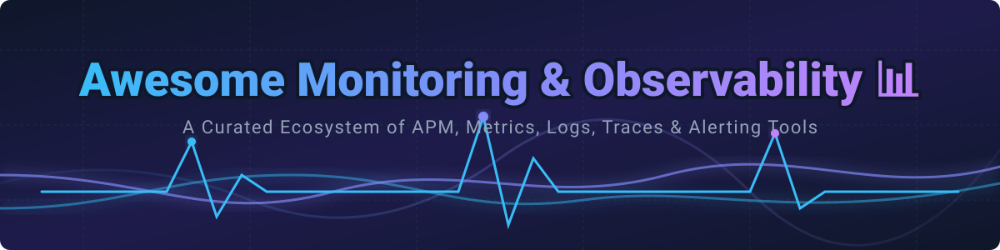

# 📊 Awesome Monitoring & Observability Ecosystem

   

  

> **A comprehensive, curated collection of top-tier SaaS platforms and open-source observability solutions for infrastructure monitoring, APM, log management, distributed tracing, metrics collection, and real-time alerting.** 🚀

---

## 📅 Last Updated: September 2026

Welcome to the ultimate **Monitoring and Observability ecosystem** guide! Whether you are building cloud-native microservices on Kubernetes, maintaining legacy enterprise infrastructure, or looking for cost-efficient open-source APM backends, this list provides structured insights into commercial SaaS offerings and open-source projects.

---

## 📑 Table of Contents
- [☁️ SaaS / Hosted Observability Platforms](#-saashosted-observability-platforms)
- [🔓 Open-Source GitHub Projects](#-open-source-github-projects)
- [🛠️ Architectural Patterns & Stack Recommendations](#%EF%B8%8F-architectural-patterns--stack-recommendations)
- [🤝 How to Contribute](#-how-to-contribute)
- [💖 Support & Sponsorship](#-support--sponsorship)
- [⚠️ Disclaimer](#%EF%B8%8F-disclaimer)
- [📈 Star History](#-star-history)

---

## ☁️ SaaS / Hosted Observability Platforms

> 💡 **Market Overview**: The global Application Performance Monitoring (APM) and Observability market is estimated at **$5.5 Billion to $7.2 Billion (2026)** with a strong CAGR of ~11-14%. The market is **moderately fragmented**, dominated by key giants like Datadog, Dynatrace, New Relic, and Splunk/Cisco, alongside high-growth specialized platforms like Honeycomb and Sentry.

Below is a detailed comparison of top commercial observability platforms sorted by enterprise valuation / market capitalization (descending):

| Platform 🏢 | Estimated Company Scale (Valuation / Market Cap) 💰 | Pricing / Starting Tier 💵 | Free Tier / Free Trial Limits 🆓 | Description 📝 |
| :--- | :--- | :--- | :--- | :--- |
| **[Splunk Observability](https://www.splunk.com/)** 🚨 | **~$28.0 Billion** (Acquired by Cisco) | $15 / host / month (Infrastructure); $55 / host / month (APM) | 14-day free trial with full feature access | Enterprise-grade metrics, APM, synthetic monitoring, and log analytics integrated with Cisco Splunk. |
| **[Datadog](https://www.datadoghq.com/)** 🐶 | **~$25.5 Billion** (Public: DDOG) | $15 / host / month (Pro); $23 / host / month (Enterprise) | 14-day full-featured free trial (Up to 5 hosts free forever on basic infra) | Leading unified full-stack observability platform covering infrastructure, APM, logs, RUM, and AI insights. |
| **[Dynatrace](https://www.dynatrace.com/)** 🤖 | **~$12.8 Billion** (Public: DT) | $0.08 / hour per 8 GiB host ($58.40/mo) | 15-day free trial with 1,000 trial hours | AI-driven observability and automatic causal analysis powered by Davis AI engine. |
| **[Elastic Cloud](https://www.elastic.co/)** 🔍 | **~$7.5 Billion** (Public: ESTC) | $95 / month (Standard tier entry baseline) | 14-day free trial on Elastic Cloud | Managed Elasticsearch, Kibana, APM, and log analytics engine for search-powered observability. |
| **[New Relic](https://newrelic.com/)** 📊 | **~$6.5 Billion** (Private Equity - Francisco Partners) | $49 / core user / month (Standard tier + $0.30/GB overage) | 100 GB/month ingest free forever (1 full-access admin user) | Unified observability suite providing APM, infrastructure, browser, and AI log management. |
| **[Grafana Cloud](https://grafana.com/products/cloud/)** 📈 | **~$6.0 Billion** (Series D Valuation) | $29 / month (Pro plan baseline + usage overages) | 10k metrics, 50 GB logs, 50 GB traces, 50 GB profile data free forever | Fully managed cloud stack powered by Grafana, Prometheus, Loki, Tempo, and Mimir. |
| **[LogicMonitor](https://www.logicmonitor.com/)** 🖥️ | **~$2.4 Billion** (Private - Vista Equity) | $22 / device / month (Pro Infrastructure tier) | 14-day free trial with full feature access | Automated hybrid infrastructure monitoring and AIOps platform for IT operations. |
| **[Sentry](https://sentry.io/)** ⚡ | **~$1.0 Billion** (Series E Valuation) | $26 / month (Team plan baseline) | 5,000 errors, 10,000 transactions, 1 GB attachments free per month | Application performance monitoring, code-level error tracking, and distributed tracing. |
| **[Honeycomb](https://www.honeycomb.io/)** 🐝 | **~$450 Million** (Series C Valuation) | $130 / month (Pro plan for 100M events/mo) | 20 Million events/month free forever | High-cardinality observability platform optimized for distributed tracing and fast exploratory debugging. |
| **[AppSignal](https://www.appsignal.com/)** 📶 | **~$30 Million** (Private / Bootstrapped scale) | $22 / month (Includes 250k requests + 5k error events) | 30-day free trial with unlimited usage | Developer-friendly APM and error tracking popular with Ruby, Elixir, Node.js, and Python teams. |

---

## 🔓 Open-Source GitHub Projects

Open-source projects form the backbone of modern observability, enabling organizations to avoid vendor lock-in and retain full data control.

Below are top open-source monitoring engines, time-series databases, log collectors, and tracing tools sorted by GitHub Star Count (descending):

| Project 📦 | GitHub Stars ⭐ | Primary Focus / Category 🎯 | Description 📝 |
| :--- | :--- | :--- | :--- |
| **[Grafana](https://github.com/grafana/grafana)** 📊 |  | Visualization & Dashboarding | The premier open-source visualization suite supporting Prometheus, Loki, Elasticsearch, Postgres, and 100+ data sources. |
| **[Prometheus](https://github.com/prometheus/prometheus)** 🔥 |  | Metrics & Alerting | CNCF graduated de-facto standard time-series collection engine with PromQL query language. |
| **[Netdata](https://github.com/netdata/netdata)** ⚡ |  | Infrastructure Monitoring | High-frequency, real-time per-second system performance monitoring with auto-detected metrics UIs. |
| **[Sentry (Self-Hosted)](https://github.com/getsentry/sentry)** 🐛 |  | Error Tracking & APM | Application crash reporting, error monitoring, and performance telemetry platform. |
| **[Jaeger](https://github.com/jaegertracing/jaeger)** 🕵️‍♂️ |  | Distributed Tracing | CNCF graduated end-to-end distributed tracing system for microservice transaction monitoring. |
| **[Zabbix](https://github.com/zabbix/zabbix)** 🏢 |  | Enterprise Infra Monitoring | Enterprise-class network, server, and cloud service monitoring with high scale alerting. |
| **[Grafana Loki](https://github.com/grafana/loki)** 📜 |  | Log Aggregation | Horizontally scalable, index-free log aggregation system designed to operate like Prometheus. |
| **[SigNoz](https://github.com/SigNoz/signoz)** 🎛️ |  | Full-Stack APM & Traces | Native OpenTelemetry APM alternative to Datadog providing logs, metrics, and traces in ClickHouse. |
| **[OpenTelemetry Collector](https://github.com/open-telemetry/opentelemetry-collector)** 📡 |  | Telemetry Pipeline | Vendor-agnostic proxy component to receive, process, and export telemetry data (traces, metrics, logs). |
| **[VictoriaMetrics](https://github.com/VictoriaMetrics/VictoriaMetrics)** ⚡ |  | Time-Series Database | Fast, cost-efficient, long-term storage solution and Prometheus-compatible TSDB backend. |
| **[SkyWalking](https://github.com/apache/skywalking)** 🌌 |  | APM & Service Mesh | Apache project providing application performance monitoring, distributed tracing, and mesh observability. |
| **[Grafana Tempo](https://github.com/grafana/tempo)** ⏱️ |  | High-Volume Tracing | Cost-effective, high-scale distributed tracing backend requiring only object storage. |
| **[Uptime Kuma](https://github.com/louislam/uptime-kuma)** 🟢 |  | Synthetic Status & Uptime | Fancy self-hosted monitoring tool for HTTP, Ping, TCP, and Status Pages. |
| **[Glances](https://github.com/nicolargo/glances)** 💻 |  | CLI Host Monitoring | Cross-platform Python-based system monitoring tool with web interface and API exporters. |
| **[Checkmk](https://github.com/Checkmk/checkmk)** 🛠️ |  | IT Infrastructure Monitoring | Comprehensive server, network, and application monitoring software built for IT operation teams. |

---

## 🛠️ Architectural Patterns & Stack Recommendations

> 💡 **Recommended Open-Source Stack**: Instrument apps using **OpenTelemetry** → Send data to **OpenTelemetry Collector** → Store metrics in **Prometheus / VictoriaMetrics**, logs in **Grafana Loki**, and traces in **Grafana Tempo / Jaeger** → Unified dashboarding and alerting in **Grafana**.

- **Best for Cost-Optimized Metrics**: VictoriaMetrics + Prometheus exporters.
- **Best for Developer Troubleshooting**: SigNoz or self-hosted Sentry.
- **Best for Hybrid Cloud SaaS**: Datadog or Grafana Cloud.

---

## 🤝 How to Contribute

Contributions are warmly welcomed! Please follow these simple guidelines:

1. 🍴 Fork the repository.
2. 📝 Add or edit entries in `README.md` maintaining table formats.
3. 🔎 Ensure factual descriptions, official links, accurate pricing, and star count badges.
4. 🚀 Open a Pull Request with a short summary of changes.

---

## 💖 Support & Sponsorship

Thank you so much for using and supporting this awesome monitoring project! If you find this repository helpful for your operational stack or developer workflows, please consider:

- ⭐ **Starring** this repository on GitHub to increase visibility.
- 🔀 **Forking** and contributing new tools or corrections.
- 📢 **Sharing** this repository with your network, team, or on social media.
- ☕ **Buying a Coffee / Sponsoring** the maintainer on the [GitHub Sponsor Dashboard](https://github.com/sponsors/ishandutta2007).

---

## ⚠️ Disclaimer

- This repository is a **community-curated list** created for informational and educational purposes.
- SaaS prices, valuations, and open-source star counts change over time. Please verify directly on official project homepages.
- Monitoring architectures process operational telemetry; verify compliance (GDPR, SOC2, HIPAA) before routing production data.

---

## 📈 Star History

---

  <b>Made with ❤️ for SREs, DevOps Engineers, and Platform Developers worldwide.</b>

